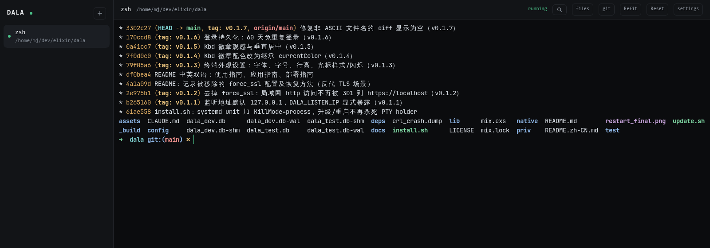
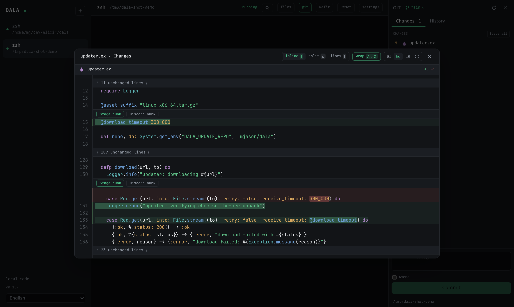
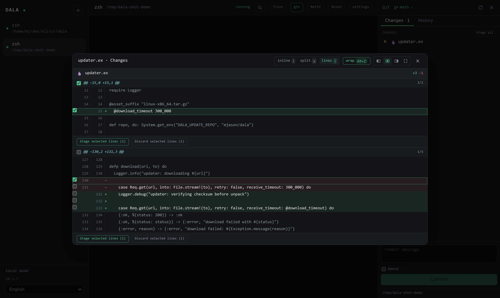
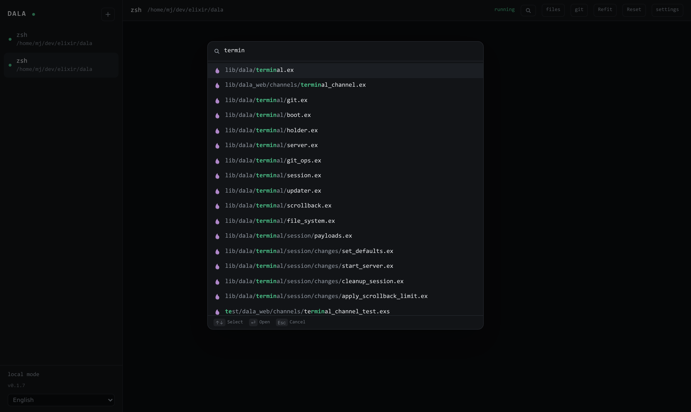

<p align="center">
  
</p>

<h1 align="center">Dala</h1>

<p align="center">AI 时代的 Web 终端：长任务不怕重启、内建 Fork 级 git review、CodeMirror 全家桶。</p>

<p align="center"><a href="README.md">English</a></p>

---



## 特性

- **持久 Shell** — 每个会话跑在独立的 PTY holder 守护进程里（dtach 模型，Rust 实现）。重启、升级 dala，shell 原样存活：tmux 的可靠性，浏览器的界面。
- **Git review** — hunk 级 **和** 行级的 stage/unstage/discard、工作区/暂存区双视角、分支切换、提交历史按文件查看、amend。全部走 libgit2 NIF，不 shell out。
- **文件管理** — VS Code 式抽屉：上传/下载/删除、拖拽、粘贴系统剪贴板里的文件、`Ctrl/⌘+P` 模糊快速打开。
- **编辑与预览** — CodeMirror 6 语法高亮编辑器、字符级 merge diff、Markdown/CSV 预览。
- **贴图给 AI CLI** — 往终端粘贴截图，dala 自动落盘并把文件路径敲进 claude code / codex / opencode 的提示符。
- **自升级** — 侧栏一键升级到最新 GitHub Release，升级期间 shell 不断线。

## 截图

| Git review——按 hunk 暂存/丢弃 | 行级暂存（`l`） |
|---|---|
|  |  |



## 快速开始（Linux x86_64）

```sh
curl -fsSL https://raw.githubusercontent.com/mjason/dala/main/install.sh | bash
```

以 systemd **用户守护进程**安装预编译包，地址 `http://localhost:4400`。
配置在 `~/.config/dala/dala.env`，数据在 `~/.local/share/dala`。

升级：点侧栏的升级按钮，或者：

```sh
curl -fsSL https://raw.githubusercontent.com/mjason/dala/main/update.sh | bash
```

## 桌面客户端

轻量 Tauri 应用（Windows / macOS / Linux，约 5 MB），VS Code 式管理多台
dala 服务器：

- **服务器菜单** — 当前窗口一键切换服务器（`Ctrl/⌘+1..9`），
  或**在新窗口打开**另一台；一窗口一服务器，像 VS Code 的多工作区
- 每台服务器的登录状态独立保存（60 天免登录），启动直达上次连接的服务器
- 内置管理页添加/删除服务器（`Ctrl/⌘+,`）

从[最新 Release](https://github.com/mjason/dala/releases/latest)下载对应
系统的安装包（`.msi`/`.exe`、`.dmg`、`.deb`/`.AppImage`），或自行构建。

> **macOS**：v0.3.8 起已签名并通过 Apple 公证（Developer ID），
> universal `.dmg` 同时支持 Apple Silicon 和 Intel，双击直接打开，
> 无任何 Gatekeeper 弹窗。

源码构建：

```sh
cd clients/desktop && npm install && npm run tauri build
```

## 使用指南

### 会话

侧栏列出你的所有 shell，`+` 新建。每个 shell 都在服务端独立的 holder 进程里运行：
关标签页、刷新、重启 dala、升级版本都不会杀死 shell。只有 shell 进程自己退出时
才会出现重启浮层。会话设置（改名、滚动缓存大小、结束/重启、删除）在 `settings` 按钮里。

### 快捷键

| 快捷键（Linux/Windows · macOS） | 功能 |
|---|---|
| `Ctrl+P` · `⌘P` | 快速打开文件（模糊搜索；macOS 下终端聚焦时也可用） |
| `Ctrl+Shift+E` · `⇧⌘E` | 文件抽屉 |
| `Ctrl+Shift+G` · `⇧⌘G` | Git 面板 |
| `Ctrl+Shift+F` · `⇧⌘F` | 重排终端宽度 |
| `Ctrl+Shift+X` · `⇧⌘X` | 重置终端 |
| `Ctrl+\``（Mac 也是 Control 键——`⌘\`` 被系统的窗口切换占用） | 从任何地方聚焦回终端 |
| `Esc` | 关闭最顶层窗口 |

文件抽屉：`↑↓` 选择 · `⏎` 打开 · `⌫` 上级目录 · `Del` 删除 ·
`Esc` 取消选中（此时上传落到根目录）· `Ctrl/⌘+V` 粘贴复制的文件。
Diff 窗口：`i` 单栏 · `s` 并排 · `l` 行选模式 · `Alt+Z` 折行。
每个按钮悬停都有快捷键提示。

### Git 面板

在仓库目录的会话里按 `Ctrl+Shift+G` 打开。

- **变更** — 已暂存/未暂存两个列表（同时有两种改动的文件在两边都出现）。
  点文件看语法高亮 diff，双视角：未暂存（index ↔ 工作区）、已暂存（HEAD ↔ index）。
- **Hunk 与行** — 每个改动块都有 Stage/Discard/Unstage 按钮（单栏、并排都有）。
  按 `l` 进入行选模式：逐行勾选 `+`/`-`，只操作选中的行。
- **提交** — 底部消息框；`修改上次提交 (--amend)` 把已暂存改动并入上一条提交
  （消息留空则保留原文）。
- **分支** — 点头部分支名列出本地/远程分支并切换（远程分支自动建本地跟踪分支），
  有冲突的脏工作区会安全报错不强切。
- **历史** — 提交日志；多文件提交带文件栏，可逐文件审阅。

### 目录跟随与 zellij/tmux

文件抽屉跟随终端的当前目录。zellij/tmux 里的 shell 挂在它们自己的
server 进程下，dala 直接感知不到——解决办法是让 shell 通过 **OSC 7**
上报目录（zellij/tmux 会透传），在 `~/.zshrc` 加：

```zsh
_osc7() { printf '\e]7;file://%s%s\a' "$HOST" "$PWD" }
autoload -U add-zsh-hook && add-zsh-hook chpwd _osc7 && _osc7
```

bash 用户（`~/.bashrc`）：

```bash
PROMPT_COMMAND='printf "\e]7;file://%s%s\a" "$HOSTNAME" "$PWD"'"${PROMPT_COMMAND:+;$PROMPT_COMMAND}"
```

配置后 zellij/tmux/嵌套 shell 里 `cd` 都会实时驱动文件抽屉。
（很多发行版的 vte.sh、WezTerm/Kitty 的 shell integration 已自带 OSC 7。）

### 给 AI CLI 贴图

在 dala 的 shell 里跑 claude code / codex / opencode，直接粘贴截图
（`Ctrl/⌘+V`）：dala 把图片存到会话目录并把路径敲进提示符——
和原生终端里这些 CLI 支持的流程一致。

## 应用指南

- **长时间跑 AI agent。** 发起一个几小时的 agent 任务，合上笔记本，之后在任何
  浏览器里回来：shell、滚动历史、agent 都还在。这是 dala 存在的核心理由——
  终端复用器也能做到，但一个带持久状态的浏览器标签页更方便携带。
- **审 AI 写的代码。** git 面板就是为「AI 写、人审」设计的：逐文件看 diff，
  只暂存你认可的行，丢弃其余，amend 补丁——全程不离开浏览器。
- **多设备访问。** 把 dala 暴露到局域网（见部署指南），开启登录，
  用手机/平板操作同一批 shell。

## 部署指南

### 目录布局

| 路径 | 用途 |
|---|---|
| `~/.local/dala/versions/<tag>` | 解包后的各版本 |
| `~/.local/dala/current` | 指向当前版本的符号链接 |
| `~/.config/dala/dala.env` | 环境配置（密钥、端口、开关） |
| `~/.config/systemd/user/dala.service` | 守护进程 unit |
| `~/.local/share/dala` | SQLite 数据库、会话存储、滚动缓存 |

unit 每次启动前先跑 `Dala.Release.migrate()`，升级自动迁移数据库；
`KillMode=process` 保证服务重启时 PTY holder（以及你的 shell）不被杀。

### 环境变量参考（`~/.config/dala/dala.env`）

| 变量 | 默认 | 含义 |
|---|---|---|
| `PORT` | `4400` | HTTP 端口 |
| `DALA_LISTEN_IP` | `127.0.0.1` | 监听地址。**默认仅本机**——设 `0.0.0.0` 暴露局域网（务必同时开登录！） |
| `DALA_AUTH_ENABLED` | `false` | 是否要求登录 |
| `DALA_USERS` | — | 预置账号，`email:password[,email2:password2]`（密码至少 8 位；每次启动生效，以此为准） |
| `PHX_HOST` / `PHX_SCHEME` / `PHX_URL_PORT` | `localhost` / `http` / 同 `PORT` | 对外 URL 组成（挂反代时设置） |
| `PHX_CHECK_ORIGIN` | `false` | WebSocket 来源校验——固定域名的反代后面建议开 |
| `DATABASE_PATH` | `~/.local/share/dala/dala.db` | SQLite 位置 |
| `DALA_DATA_DIR` | `~/.local/share/dala` | 会话存储与滚动缓存 |
| `DALA_RELEASE_ROOT` | install.sh 设置 | 存在时启用应用内升级 |
| `DALA_UPDATE_REPO` / `DALA_SERVICE` | `mjason/dala` / `dala` | 升级源仓库 / systemd unit 名 |
| `SECRET_KEY_BASE` / `TOKEN_SIGNING_SECRET` | 自动生成 | 会话/令牌密钥——注意保密 |

改完执行 `systemctl --user restart dala`（shell 存活）。

### 服务管理

```sh
systemctl --user status dala
journalctl --user -u dala -f
systemctl --user restart dala
```

`install.sh` 已执行 `loginctl enable-linger`，注销后守护进程照常运行。

### 局域网访问

1. `dala.env` 里：`DALA_LISTEN_IP=0.0.0.0`、`DALA_AUTH_ENABLED=true`、
   `DALA_USERS=you@example.com:yourpassword`，然后重启服务。
2. 其他设备访问 `http://<机器IP>:<端口>`。
3. **WSL2**：使用镜像网络（`.wslconfig` → `networkingMode=mirrored`），
   并放行 Hyper-V 防火墙端口（管理员 PowerShell）：

   ```powershell
   New-NetFirewallHyperVRule -Name dala-4400 -DisplayName "dala 4400" `
     -Direction Inbound -VMCreatorId "{40E0AC32-46A5-438A-A0B2-2B479E8F2E90}" `
     -Protocol TCP -LocalPorts 4400
   ```

终端服务器交出去的是你的 shell——没有登录保护绝不要暴露；
公网访问优先走 VPN（如 tailscale），不要裸暴露。

### HTTPS / 反向代理

dala 设计上只提供 http，TLS 交给前置反代（nginx/caddy）。
Phoenix 生成器自带的 `force_ssl` 已在 v0.1.2 移除——它只豁免 `localhost`，
用局域网 IP 访问会被 301 到 `https://localhost/`。如果以后挂了 TLS 反代想
强制 https，把这段加回 `config/prod.exs`（编译期配置，需重新构建发布）：

```elixir
config :dala, DalaWeb.Endpoint,
  force_ssl: [
    rewrite_on: [:x_forwarded_proto],
    exclude: [
      hosts: ["localhost", "127.0.0.1"]
    ]
  ]
```

并在 `dala.env` 设置 `PHX_SCHEME=https`、`PHX_HOST=<域名>`、`PHX_CHECK_ORIGIN=true`。

### 发布与源码构建

发布产物由 GitHub Actions 在打 `v*` tag 时自动构建
（`.github/workflows/release.yml`）：生产前端（minify + digest）、Rust NIF、
PTY holder，打包为 `dala-<tag>-linux-x86_64.tar.gz`。

本地开发需要 Elixir 1.19+/OTP 28、Rust、Node 22：

```sh
mix setup
mix phx.server        # http://localhost:4000
```

## 架构速览

- Phoenix + Bandit 服务端，React + xterm.js 前端（Phoenix Channels 传输）
- 每会话一个 `dala_holder`（Rust）：daemon 化持有 PTY，**内嵌无头终端模拟器**
  （`alacritty_terminal`）——tmux 模型。attach 拿到的是合成重绘
  （历史尾部 + 当前屏 + 光标 + 模式），不再重放原始字节流，attach 耗时与
  历史输出总量无关，vim/htop 这类全屏应用跨重启精确恢复
- `dala_git`（Rustler + libgit2）：status/diff/stage/patch apply/分支/checkout 全走 NIF
- SQLite（Ash + Ecto）存账户，DETS 存会话与滚动缓存

## License

MIT
